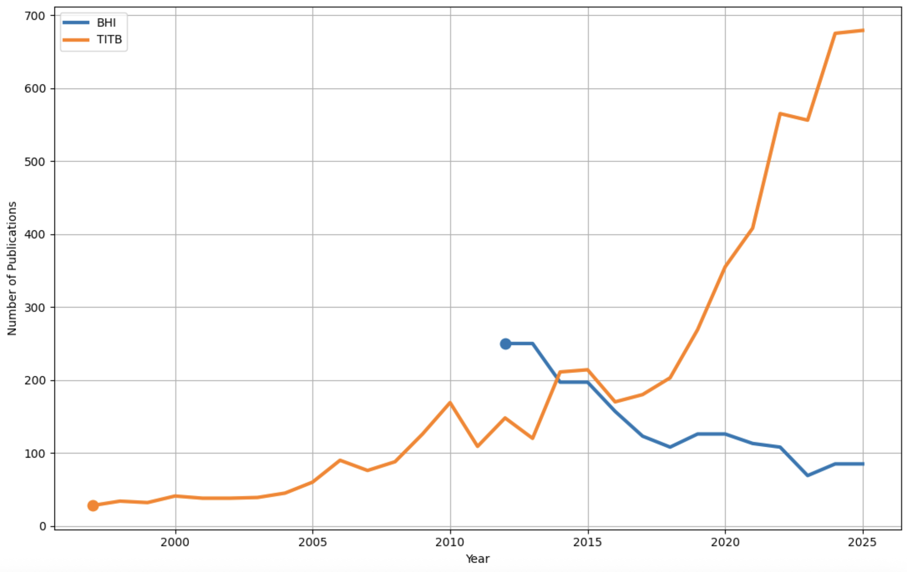

# BHI and T-ITB Publication Data Extraction

This repository is dedicated to the extraction and processing of publication data from the following sources:

- **International Conference on Biomedical and Health Informatics (BHI)**
- **IEEE Journal of Biomedical and Health Informatics (T-ITB)** now **(J-BHI)**

## Purpose

The primary goal of this repository is to facilitate the extraction, parsing, and analysis of publication data from BHI and T-ITB. This includes:

1. Parsing raw data files to extract relevant publication information.
2. Matching extracted data with OpenAlex for citation information and keywords.
3. Data analysis

## JSON Data Layout

This repository includes JSON files that store publication data. Below is the structure of the JSON files:

### `bhipubdata.json` and `titbpubdata.json`
Each file contains an array of objects, where each object represents a publication with the following properties:

- **key**: A unique identifier for the publication from DBLP.
- **title**: The title of the publication.
- **author**: An array of authors' names.
- **year**: The year of publication.
- **ee**: A link to the publication (e.g., DOI).
- **id**: A unique identifier from OpenAlex.
- **concepts**: An array for concepts related to the publication.
- **referenced_works**: An array of references cited by the publication.
- **cited_by_count**: The number of times the publication has been cited.

### Statistics

#### BHI Publications
- **Total Publications**: 1348
- **Matched**: 1336
- **Unmatched**: 12

#### T-ITB Publications
- **Total Publications**: 5788
- **Matched**: 5766
- **Unmatched**: 22

## Acknowledgments
- Data sources: BHI, T-ITB, OpenAlex, and DBLP.
- Tools: Python, Jupyter, and related libraries.